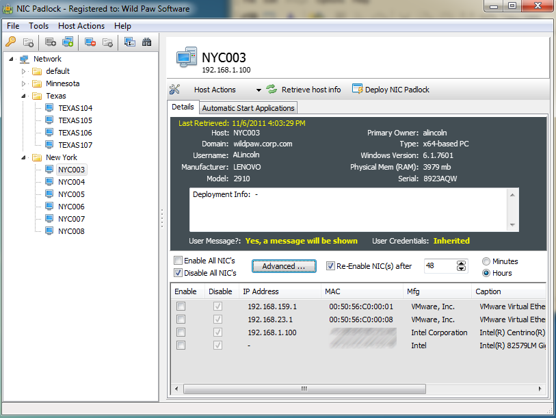

# NIC Padlock

This is a commercial program I personally developed in ~2011 and sold for a time. It's no longer actively updated, but I did design and develop 100% of this Windows program (and embedded Windows service that is deployed to remote systems).

The documentation still lives on in an S3 bucket, and [includes screenshots](http://wildpawsoftware.com.s3-website-us-west-2.amazonaws.com/nicpadlock/screenshots/).

## Reviews
Softpedia reviewed the application and included [several screenshots here](https://www.softpedia.com/get/Network-Tools/Misc-Networking-Tools/NIC-Padlock.shtml).

## Description
NIC Padlock is designed to allow a system administrator to either temporarily or permanently disable a remote system’s network interface cards (NIC’s). NIC Padlock also supports enforcing that all adapters are enabled on the remote system. A quick summary of its features are:

 - Disable all network adapters
 - Choose to display a message to the user when NIC’s are disabled
 - Enable all network adapters
 - Re-enable the adapters that were disabled after a configurable time period
 - Retrieve a remote computer’s list of auto-run programs

In a recent survey of IT managers and executives, nearly half of respondents admitted that if they were fired tomorrow they would walk out with proprietary data such as privileged password lists, company databases, R&D plans and financial reports — even though they know they are not entitled to it.

With NIC Padlock, you can easily disable the network capabilities of a recently (or soon to be) departed employee’s desktop or laptop. This can help ensure that your company’s data stays protected.

## Usage Scenarios

NIC Padlock is a great solution when you need to ensure that a remote host is disconnected from your network immediately. You may require this to happen for several reasons:

### Host is infected, or possibly infected, with high-risk malware
If a remote computer has, or potentially has, a sensitive data stealing Trojan (such a Zeus, SpyEye TDL4, etc) it is imperative to immediately remove that system from your network to keep the data from being lost as well as to prevent the virus from spreading. NIC Padlock provides this capability.

Using NIC Padlock, even if the user plugs their computer into a different network port they will not be able to gain access to your network.

NIC Padlock also retrieves a list of a remote system's applications that are configured to run automatically at startup, which can be used to determine the possibility of a virus infection.

### An employee leaves your organization
When an employee leaves your organization, NIC Padlock can provide essential peace of mind by ensuring that the recently departed employee is not able to use a wired or wilress network in order to electronically send customer information, product information, or sensitive data from the workstation still in their possession.

In addition, if the employee that is leaving works from home or remotely, NIC Padlock can ensure that they are unable to connect to your network using any VPN connections to your company.

### A host is under heavy load or DDOS attack
If you are experiencing an unexpected heavy load on a production or test system, NIC Padlock can allow you to temporarily disable the host's network cards and can automatically re-enable them after a number of minutes or hours that you define.

### Virtual Computers
In many organizations it is not uncommon to have several virtual computers running on a single server or workstation, using such technologies Microsoft's Hyper-V, VMWare's many virtualization products, Parallels virtualization of Window's systems on Mac OS X (to name just a few).

It may not always be clear on which physical hardware a virtual computer is running. If you encounter any of the above scenarios occurring on one of your virtual host's, NIC Padlock can provided the quickest way to take a virtual system off your network either temporarily or permanently.